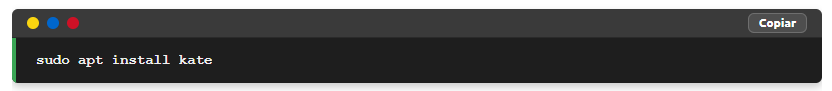
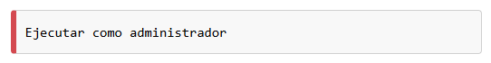

# El porqué de este script

Estoy usando markdown para escribir mis tutoriales y luego el archivo .md resultante con pandoc lo convierto a html y lo pego en una entrada de Blogger, pero como:

- Las cajas de código tienen una vista no muy bien aceptable
- Las tablas convertidas no tienen los bordes de colores
- Los elementos `<code>` simples se ven como texto normal

Este script sirve para aplicar un fix al archivo html dado por pandoc y que quede bonito.


Flujo de trabajo

```
Markdown
   ↓
Pandoc
   ↓
HTML
   ↓
gui_html_fixer.py (mejora cajas de código + botón copiar)
   ↓
Publicación en Blogger
   ↓
JS del tema habilita copiar al portapapeles
```

# Tutorial de Instalación y Uso de HTML Fixer en Debian

Este tutorial explica cómo instalar las dependencias necesarias y cómo utilizar el script en sus versiones de línea de comandos (CLI) y con interfaz gráfica (GUI) en Debian 12.

---

## Instalación de Dependencias

Antes de ejecutar el script, necesitas instalar algunas dependencias necesarias. Para ello, abre una terminal y ejecuta los siguientes comandos:

```sh
sudo apt update
sudo apt install python3-bs4 python3-tk pandoc git
```

- `python3-bs4`: Instala BeautifulSoup4 para manipulación de HTML.
- `python3-tk`: Instala Tkinter para la versión con GUI.
- `pandoc`: Convierte archivos Markdown a HTML.

---

## Previo al uso, ti tenías el archivo en markdown conviertelo a html con pandoc

Con mucha frecuencia primero edito mi entrada para Blogger en mardown en mi editor preferido [VNote](https://facilitarelsoftwarelibre.blogspot.com/2025/05/como-descargar-vnote-editor-de-markdown-y-hacerlo-funcionar-en-linux-debian-mx-ubuntu-mint-con-manual.html)
 
Si tienes un archivo Markdown (`archivo.md`), conviértelo a HTML con:

```sh
pandoc archivo.md -o archivo.html
```

###  Consejo para aplicar el fix a archivos markdown que no tienen etiquetas en las cajas de código
Cuando vaya a convertir un markdown que tiene cajas de comandos de terminal asegúrese que tiene la etiqueta de cada código pues sino no se convierte la caja, ejemplo deben estar así:

~~~markdown
```bash
sudo apt update
```
~~~

o si es algún código en python:

~~~markdown
```python
print("Hola, mundo!")
```
~~~

y si es sólo texto:

~~~markdown
```plaintext
ejemplo de texto en una caja de código
```
~~~


---

# Uso en Windows

Este script también funciona en **Windows** siempre que tengas **Python instalado y agregado al PATH**.

## 1. Instalar Python

Descarga Python desde:

https://www.python.org/downloads/

Durante la instalación **activa la opción**:

☑ **Add Python to PATH**

Esto permitirá ejecutar `python` desde PowerShell o CMD.

Para verificar la instalación abre **PowerShell** y ejecuta:

```powershell
python --version
```

Si aparece algo como:

```
Python 3.x.x
```

entonces Python está correctamente instalado.

---

## 2. Instalar la dependencia BeautifulSoup

Este script necesita la librería **BeautifulSoup4**.

Instálala con:

```powershell
python -m pip install beautifulsoup4
```

---

## 3. Ejecutar el programa

Coloca el archivo:

```
gui_html_fixer.py
```

en cualquier carpeta.

Luego abre **PowerShell en esa carpeta** y ejecuta:

```powershell
python gui_html_fixer.py
```

Se abrirá la **interfaz gráfica** del programa.

Desde allí podrás:

- Elegir el tamaño de fuente para las tablas
- Seleccionar el archivo `.html` generado por `pandoc`
- Generar automáticamente el archivo corregido

El archivo resultante se guardará como:

```
archivo-fix.html
```

---
## Uso de HTML Fixer

Puedes utilizar HTML Fixer en dos formas:

### 1. Aplicar el Fix al HTML con la versión GUI (Interfaz Gráfica)

1. Ejecuta el script GUI con:

```sh
python3 gui_html_fixer.py
```

2. Se abrirá una ventana donde podrás:

   - Especificar el tamaño de fuente para las tablas (por defecto 80%)
   - Seleccionar el archivo `.html` generado con `pandoc`
   
3. El script aplicará automáticamente:

   - Estilos profesionales a bloques de código `<pre class="sourceCode">`
   - Mejoras visuales a todas las tablas
   - Formato especial a elementos `<code>` simples
   - Diseño responsive para todos los elementos

4. Se guardará automáticamente como `archivo-fix.html`.

5. El programa mostrará la ubicación del archivo generado.

## Caracteristicas de lo que hace el script

El script realiza las siguientes mejoras visuales:

### **Para bloques de código del método `def mejorar_caja_codigo(html):`

El script convierte las cajas de código que en markdown si tenían tag, ejemplo, esto:

```bash
sudo apt install kate
```

con pandoc lo convierto en esto:

```html
<div class="sourceCode" id="cb1"><pre
class="sourceCode bash"><code class="sourceCode bash"><span id="cb1-1"><a href="#cb1-1" aria-hidden="true" tabindex="-1"></a><span class="fu">sudo</span> apt install kate</span></code></pre></div>
```

y con el script (con el método `def mejorar_caja_codigo(html):`) se convierte en esto:

```html
<div class="sourceCode" id="cb1"><div style="margin: 15px 0; border-radius: 6px; overflow: hidden; box-shadow: 0 4px 8px rgba(0,0,0,0.2);"><div style="background: #3a3a3a; height: 28px; display: flex; align-items: center; padding: 0 15px; border-bottom: 1px solid #2a2a2a; "><span style="background: #FAD510; width: 12px; height: 12px; border-radius: 50%; margin-right: 8px; "></span><span style="background: #0066CC; width: 12px; height: 12px; border-radius: 50%; margin-right: 8px; "></span><span style="background: #CE1126; width: 12px; height: 12px; border-radius: 50%; margin-right: 8px; "></span><button aria-label="Copiar código" class="code-copy-btn" style="margin-left:auto;background:rgba(255,255,255,0.10);border:1px solid rgba(255,255,255,0.18);color:#fff;border-radius:6px;padding:3px 10px;font-size:12px;font-weight:700;cursor:pointer;line-height:1;" title="Copiar código" type="button">Copiar</button></div><pre class="sourceCode bash" style="background: #1e1e1e; color: #f0f0f0; font-family: 'Ubuntu Mono', 'Courier New', monospace; font-weight: bold; font-size: 14px; line-height: 1.5; margin: 0; padding: 12px 20px; border-left: 4px solid #3aa655; overflow: auto; max-height: 500px; "><code class="sourceCode bash" style="color: inherit; font-family: inherit;"><span id="cb1-1"><a aria-hidden="true" href="#cb1-1" tabindex="-1"></a><span class="fu">sudo</span> apt install kate</span></code></pre></div></div>
```

y esto se ve así:




### Para bloques de código del método `def mejorar_bloques_code_simples(html):`

El script convierte las cajas de código que en markdown no tenían tag, ejemplo, esto:

```
Ejecutar como administrador
```

con pandoc lo convierto en esto:

```html
<pre><code>Ejecutar como administrador</code></pre>
```

y con el script (con el método `def mejorar_bloques_code_simples(html):`) se convierte en esto:

```html
<div><pre style="background-color: #f8f8f8; border: 1px solid #d0d0d0; border-left: 6px solid #d44950; line-height: 1.5; margin: 10px 0; overflow-x: auto; padding: 10px; border-radius: 4px; "><span style="color: #000000; font-family: 'Ubuntu Mono', Consolas, monospace; "><span style="font-size: 15px; white-space: pre; ">Ejecutar como administrador</span></span></pre></div>
```

y queda así:




### **Para elementos `<code>` simples**

Para código en línea dentro del texto en archivos markdown, ejemplo:

~~~
`sudo apt update`
~~~

ese se convertirá a `<code>` en html, y se aplicará lo siguiente:

- Fondo gris muy claro (#f5f5f5)
- Borde sutil (#d0d0d0)
- Fuente monoespaciada
- Color de texto rojizo (#c7254e)
- Pequeño padding y bordes redondeados


### **Para tablas**

- Encabezado con fondo negro y texto blanco
- Filas alternas (blanco / gris claro)
- Bordes negros (1px solid black)
- Texto que se ajusta automáticamente
- Contenedor responsive con scroll horizontal


## Aplicar el Fix al HTML desde la terminal de Linux o de Termux en Android con `cli_html_fixer.py`

### Requisitos para Linux

**Para Linux **todo lo que necesita el programa ya está instalado

### Requisitos para Termux

**Para Termux** en Android necesitas lo siguiente si estás en un celular con Android:  [https://github.com/wachin/Instalar-git-en-Android-con-Termux](https://github.com/wachin/Instalar-git-en-Android-con-Termux) y luego instala las siguientes dependencias:

```sh
pkg install git pandoc python3
```

y luego instalar el paquete beautifulsoup4 con el comando: 

```sh
python -m pip install bs4
```

#### **Modo de uso**:

Coloca el archivo `cli_html_fixer.py` en la misma carpeta donde esté el archivo HTML al que deseas aplicar el fix.

Las especificaciones para ejecutarlo son:

```bash
python3 cli_html_fixer.py [opciones] archivo.html
````

### Opciones disponibles

* `-o` o `--output`: Especifica el archivo de salida
* `-f` o `--font`: Tamaño de fuente para tablas (ej: 90%, 1em)
* `-h` o `--help`: Muestra ayuda

### Ejemplos

Procesar `archivo.html` y guardar como `archivo-fix.html`:

```bash
python3 cli_html_fixer.py archivo.html
```

Especificar archivo de salida y tamaño de fuente:

```bash
python3 cli_html_fixer.py -o salida.html -f 90% archivo.html
```

---

### Características de esta versión CLI

* **Ligera**: Funciona perfectamente en Linux, Termux y Android
* **Opciones configurables**: Tamaño de fuente y archivo de salida
* **Manejo de errores**: Detecta archivos inválidos y muestra ayuda
* **Motor visual profesional**:

  * Cajas de código negras tipo terminal
  * Barra superior tricolor 🇪🇨
  * Bloques `<pre><code>` simples mejorados
  * Elementos `<code>` inline estilizados
  * Tablas formateadas automáticamente
* **Totalmente compatible con la versión GUI**
* **Ideal para flujos Markdown → HTML → GitHub Pages o Blogger**

El script generará un nuevo archivo con el sufijo `-fix.html` (a menos que especifiques otro nombre con `-o`) con todas las mejoras visuales aplicadas.


### **Recomendaciones adicionales**
- Puedes usar cualquier editor de texto para escribir en Markdown.
- `pandoc` permite muchas opciones adicionales para mejorar la conversión de Markdown a HTML.
- Asegúrate de que el script esté en el mismo directorio donde ejecutas los comandos o proporciona la ruta completa.
- Para elementos `<code>`, el script no modifica aquellos que ya están dentro de bloques `<pre>` para evitar duplicar estilos.

Esta es la forma en la que convierto markdown a html para algunas de mis entradas en Blogger. 🚀

---

## 🧩 Convertir páginas web a Markdown con cajas de código funcionales (Script para etiquetar bloques de código en Markdown)

Cuando convierto una página web a Markdown usando:

> [https://urltomarkdown.com/](https://urltomarkdown.com/)

las cajas de código se generan así:

~~~
```
sudo apt update
```
~~~

Eso **no es suficiente** para que Pandoc genere bloques `<pre class="sourceCode">`, que son los que luego nuestro **HTML Fixer** puede estilizar correctamente.

Para que el flujo funcione, cada caja debe tener un lenguaje:

~~~
```bash
sudo apt update
```
~~~

Sin esa etiqueta, Pandoc genera un `<pre><code>` simple y no una caja de código real.

---

# 🔧 Solución: etiquetar automáticamente las cajas de código

Para resolver esto he creado un script que toma un archivo `.md` y **añade automáticamente una etiqueta de lenguaje** (`bash`, `python`, `html` o `plaintext`) a **todas las cajas de código**.

Hay dos versiones:
- `tag_markdown_gui.py` (interfaz gráfica)
- `tag_markdown_cli.py` (línea de comandos)

Ambas hacen exactamente lo mismo.

---

# 🖥️ 1) Uso de `tag_markdown_gui.py` (versión gráfica)

Esta versión es ideal si prefieres trabajar de forma visual.

## Cómo usarlo

1. Ejecuta el script:

```bash
python3 tag_markdown_gui.py
```

**Nota**: En algunos Linux está un opción para ejecutar scripts python con clic derecho.

2. Se abrirá una ventana con:

   * Un botón **"Buscar Archivo .md"**
   * Un selector de lenguaje (por defecto `bash`)
   * Un botón **"Procesar"**

3. Haz clic en **"Buscar Archivo .md"** y selecciona tu archivo Markdown.

4. Elige el lenguaje que deseas aplicar a todas las cajas de código:

   * `bash` (comandos de terminal)
   * `python`
   * `html`
   * `plaintext` (texto simple)

5. Haz clic en **"Procesar"**.

El programa generará automáticamente:

```
archivo-taged.md
```

Este nuevo archivo ya tiene todas las cajas de código correctamente etiquetadas y listo para ser convertido por Pandoc.

---

# 🖥️ 2) Uso de `tag_markdown_cli.py` (versión de terminal)

Esta versión es ideal para automatizar el flujo o usar en Termux, servidores o scripts.

## Sintaxis

```bash
python3 tag_markdown_cli.py [opciones] archivo.md
```

## Opciones

* `-l` o `--lang` → Lenguaje a usar (`bash`, `python`, `html`, `plaintext`)
* `-o` o `--output` → Archivo de salida
* `-h` o `--help` → Muestra ayuda

## Ejemplos

Etiquetar todas las cajas como `bash`:

```bash
python3 tag_markdown_cli.py archivo.md
```

Usar Python:

```bash
python3 tag_markdown_cli.py -l python archivo.md
```

Elegir nombre de salida:

```bash
python3 tag_markdown_cli.py -l bash -o archivo-taged.md archivo.md
```

El resultado será un archivo:

```
archivo-taged.md
```

---

### Pagina Web > Markdown + Etiquetas > HTML > HTML + FIX

Este es el flujo profesional que uso para convertir páginas web en artículos técnicos con código bien formateado:

1. Convertir una página web a Markdown
   👉 [https://urltomarkdown.com/](https://urltomarkdown.com/)

2. Etiquetar las cajas de código:

```bash
python3 tag_markdown_cli.py archivo.md
```

(o usando `tag_markdown_gui.py`)

3. Convertir a HTML con Pandoc:

```bash
pandoc archivo-taged.md -o archivo.html
```

4. Aplicar el HTML Fixer:

```bash
python3 cli_html_fixer.py archivo.html
```

5. Subir a Blogger el archivo final:

```
archivo-fix.html
```

---

## 🎯 Resultado final

Con este flujo obtienes:

* Cajas de código negras tipo terminal 🇪🇨
* Tablas con estilo
* Código inline resaltado
* HTML limpio y profesional para Blogger o GitHub Pages

Esto convierte cualquier página web común en un **artículo técnico de alta calidad** 🚀

---

## Diferencia entre la versión GUI y la versión CLI

Este proyecto incluye **dos formas de aplicar el fix al HTML**:

### GUI (Interfaz gráfica)
Archivo:

```
gui_html_fixer.py
```

Características:

- Interfaz gráfica con selector de archivo
- Permite elegir el tamaño de fuente de las tablas
- Valor por defecto: **95%**
- Ideal para trabajar de forma visual

Se ejecuta con:

```bash
python3 gui_html_fixer.py
```

o en Windows:

```powershell
python gui_html_fixer.py
```

---

### CLI (Línea de comandos)

Archivo:

```
cli_html_fixer.py
```

Características:

- Ideal para automatizar flujos de trabajo
- Compatible con Linux, Windows y Termux
- Permite especificar archivo de salida y tamaño de fuente
- Tamaño de fuente por defecto: **95%**

Ejemplo:

```bash
python3 cli_html_fixer.py archivo.html
```

o:

```bash
python3 cli_html_fixer.py -o salida.html -f 95% archivo.html
```

---

# Cómo añadí un botón "Copiar" a las cajas de código

Una mejora muy útil es añadir un **botón "Copiar"** a las cajas de código que genera `gui_html_fixer.py`.

La idea es colocar el botón en la **barra de terminal** que el script ya crea encima de cada bloque `<pre class="sourceCode">`.

Luego el botón copiará automáticamente el código al portapapeles.

---

## 1. Modificado el script `gui_html_fixer.py`

Dentro de la función `mejorar_caja_codigo()` está añadido el siguiente código **después de crear los puntos de colores**:

```python
# --- Botón "Copiar" ---
copy_btn = soup.new_tag('button', attrs={
    "type": "button",
    "class": "code-copy-btn",
    "title": "Copiar código",
    "aria-label": "Copiar código",
    "style": (
        "margin-left:auto; "
        "background: rgba(255,255,255,0.10); "
        "border: 1px solid rgba(255,255,255,0.18); "
        "color: #fff; "
        "border-radius: 6px; "
        "padding: 4px 10px; "
        "font-size: 12px; "
        "font-weight: 700; "
        "cursor: pointer;"
    )
})
copy_btn.string = "Copiar"
terminal_bar.append(copy_btn)
```

Esto añade automáticamente un botón **Copiar** en cada caja de código.

---

## 2. Añadir el JavaScript en el tema de Blogger

Para que el botón funcione debes añadir un pequeño script en tu **tema de Blogger**.

Abre tu archivo de tema y pega el siguiente código **antes de `</body>`**:

```html
<!-- Script para botón Copiar en cajas de código -->
<script>
//<![CDATA[
(function () {
  function getCodeText(pre) {
    const code = pre.querySelector("code");
    return (code ? code.innerText : pre.innerText).replace(/\n$/, "");
  }

  async function copyText(text) {
    if (navigator.clipboard && window.isSecureContext) {
      await navigator.clipboard.writeText(text);
      return true;
    }

    const ta = document.createElement("textarea");
    ta.value = text;
    ta.setAttribute("readonly", "");
    ta.style.position = "fixed";
    ta.style.top = "-9999px";
    document.body.appendChild(ta);
    ta.select();
    const ok = document.execCommand("copy");
    document.body.removeChild(ta);
    return ok;
  }

  document.addEventListener("click", async (ev) => {
    const btn = ev.target.closest(".code-copy-btn");
    if (!btn) return;

    const container = btn.closest("div");
    const pre = container ? container.querySelector("pre") : null;
    if (!pre) return;

    const text = getCodeText(pre);

    const old = btn.textContent;
    try {
      await copyText(text);
      btn.textContent = "¡Copiado!";
    } catch (e) {
      btn.textContent = "Error";
    }
    setTimeout(() => (btn.textContent = old), 1200);
  });
})();
//]]>
</script>
```

---

## Resultado

Después de aplicar estas modificaciones:

- Cada bloque de código tendrá un botón **Copiar**
- El código se copiará directamente al portapapeles
- No se necesitan librerías externas
- Todo funciona desde el tema de Blogger

Esto mejora mucho la experiencia para los lectores de tutoriales técnicos.
