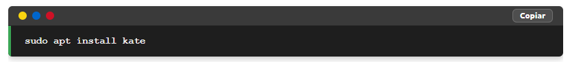
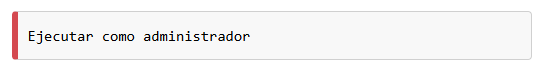

# Blogger HTML Fixer — Code Boxes, Tables and Copy Button

[](https://www.python.org/)
[](#)
[](https://riverbankcomputing.com/software/pyqt/)
[](https://www.crummy.com/software/BeautifulSoup/)

> 🇪🇸 ¿Prefieres leer esto en español? Consulta [README_ES.md](README_ES.md)

Tool for improving HTML files generated by Pandoc before publishing them on Blogger. Fixes the appearance of code boxes, tables and inline `<code>` elements. Also includes a tool for cleaning bibliographic references copied from PubMed Central.

---

## Included scripts

|            Script             |    Type     |                      Function                      |
| ----------------------------- | ----------- | -------------------------------------------------- |
| `html_blogger_fixer_gui.py`   | GUI (PyQt6) | Applies the HTML fix with a graphical interface    |
| `html_blogger_fixer_cli.py`   | CLI         | Applies the HTML fix from the terminal             |
| `tag_markdown_gui.py`         | GUI (PyQt6) | Tags code blocks in `.md` files                    |
| `tag_markdown_cli.py`         | CLI         | Tags code blocks from the terminal                 |
| `arreglar_referencias_pmc.py` | GUI (PyQt6) | Cleans references copied from PMC / PubMed Central |

---

## Full workflow

```
Markdown
   ↓
(optional) tag_markdown_gui.py / tag_markdown_cli.py
   → adds language tags to untagged code blocks
   ↓
pandoc file.md -o file.html
   ↓
html_blogger_fixer_gui.py / html_blogger_fixer_cli.py
   → improves code boxes, tables and inline code
   ↓
file-fix.html
   ↓
Paste into Blogger (HTML editor)
   ↓
JS in the theme enables the "Copy" button
```

---

## Get the program

```bash
git clone https://github.com/wachin/html-fix-blogger-post
```

Or download the ZIP from the green GitHub button and extract it.

---

## Installation

### Linux — Debian, Ubuntu and derivatives

```bash
sudo apt update
sudo apt install python3-bs4 python3-pyqt6 qt6-translations-l10n qt6-gtk-platformtheme python3-pyqt6.qtsvg qttools5-dev-tools pandoc git
```

- `python3-bs4` — BeautifulSoup4 for HTML manipulation
- `python3-pyqt6` — PyQt6 for the GUI versions
- `qt6-translations-l10n` — Qt translations (dialogs in the system language)
- `qt6-gtk-platformtheme` — native OS file dialog with `Ctrl+F` support
- `python3-pyqt6.qtsvg` — renders the SVG application icon
- `qttools5-dev-tools` — provides `lrelease` to compile `.ts` translation files to `.qm`
- `pandoc` — converts Markdown to HTML

Packages available at:
- [packages.debian.org/python3-bs4](https://packages.debian.org/python3-bs4) (since bullseye)
- [packages.ubuntu.com/python3-bs4](https://packages.ubuntu.com/python3-bs4)

### Android — Termux

```bash
pkg install git pandoc python3
python -m pip install bs4 PyQt6
```

Guide for installing git on Termux: [github.com/wachin/Instalar-git-en-Android-con-Termux](https://github.com/wachin/Instalar-git-en-Android-con-Termux)

### Windows

1. Download Python from [python.org/downloads](https://www.python.org/downloads/) and enable **Add Python to PATH** during installation.

2. Verify the installation by opening PowerShell:

```powershell
python --version
```

3. Install the dependencies:

```powershell
python -m pip install beautifulsoup4 PyQt6
```

4. Install Pandoc from [pandoc.org/installing](https://pandoc.org/installing.html) if you need to convert Markdown to HTML.

### macOS

1. Check if Python is installed:

```bash
python3 --version
```

If not installed, install it with Homebrew:

```bash
brew install python
```

If you don't have Homebrew, install it from [brew.sh](https://brew.sh/).

2. Install the dependencies:

```bash
pip3 install beautifulsoup4 PyQt6
```

3. Install Pandoc if needed:

```bash
brew install pandoc
```

---

## Running the scripts

### Linux and macOS

```bash
python3 html_blogger_fixer_gui.py
python3 html_blogger_fixer_cli.py file.html
python3 tag_markdown_gui.py
python3 tag_markdown_cli.py file.md
python3 arreglar_referencias_pmc.py
```

### Windows

```powershell
python html_blogger_fixer_gui.py
python html_blogger_fixer_cli.py file.html
python tag_markdown_gui.py
python tag_markdown_cli.py file.md
python arreglar_referencias_pmc.py
```

---

## Translations (i18n)

The GUI programs use Qt Linguist `.ts` / `.qm` files for internationalization. The translation files live in the `translations/` folder.

The application automatically loads the translation matching the system locale. If no translation is found it falls back to English.

### Available translations

| File | Language |
|---|---|
| `translations/html_blogger_fixer_en.ts` / `.qm` | English (base) |
| `translations/html_blogger_fixer_es.ts` / `.qm` | Spanish |
| `translations/html_blogger_fixer_ru.ts` / `.qm` | Russian |
| `translations/html_blogger_fixer_ja.ts` / `.qm` | Japanese |
| `translations/html_blogger_fixer_ko.ts` / `.qm` | Korean |
| `translations/html_blogger_fixer_fr.ts` / `.qm` | French |
| `translations/html_blogger_fixer_de.ts` / `.qm` | German |
| `translations/html_blogger_fixer_zh_CN.ts` / `.qm` | Chinese (Simplified) |
| `translations/html_blogger_fixer_zh_TW.ts` / `.qm` | Chinese (Traditional) |
| `translations/html_blogger_fixer_pt_BR.ts` / `.qm` | Portuguese (Brazil) |

### Testing a specific language from the terminal

You can force the program to run in any language without changing your system locale by setting the `LANGUAGE` environment variable before launching:

```bash
# Russian
LANGUAGE=ru python3 html_blogger_fixer_gui.py

# Japanese
LANGUAGE=ja python3 html_blogger_fixer_gui.py

# Korean
LANGUAGE=ko python3 html_blogger_fixer_gui.py

# French
LANGUAGE=fr python3 html_blogger_fixer_gui.py

# German
LANGUAGE=de python3 html_blogger_fixer_gui.py

# Chinese (Simplified)
LANGUAGE=zh_CN python3 html_blogger_fixer_gui.py

# Chinese (Traditional)
LANGUAGE=zh_TW python3 html_blogger_fixer_gui.py

# Portuguese (Brazil)
LANGUAGE=pt_BR python3 html_blogger_fixer_gui.py

# Spanish
LANGUAGE=es python3 html_blogger_fixer_gui.py

# English (default fallback)
LANGUAGE=en python3 html_blogger_fixer_gui.py
```

On Windows (PowerShell):

```powershell
$env:LANGUAGE="fr"; python html_blogger_fixer_gui.py
```

On Windows (CMD):

```cmd
set LANGUAGE=fr && python html_blogger_fixer_gui.py
```

### Compiling translations after editing a `.ts` file

```bash
lrelease translations/html_blogger_fixer_es.ts -qm translations/html_blogger_fixer_es.qm
```

On Linux `lrelease` is provided by the `qttools5-dev-tools` package:

```bash
sudo apt install qttools5-dev-tools
```

On Windows and macOS it is included with the Qt installation or available via `pip install PyQt6-tools`.

### Adding a new language

1. Copy `translations/html_blogger_fixer_en.ts` to `translations/html_blogger_fixer_XX.ts`  
   (where `XX` is the locale code, e.g. `fr`, `de`, `pt_BR`)
2. Open the file in **Qt Linguist** or any text editor and fill in the `<translation>` tags
3. Compile it:

```bash
lrelease translations/html_blogger_fixer_XX.ts -qm translations/html_blogger_fixer_XX.qm
```

The program will pick it up automatically on a system with that locale.

---

## Before you start: convert Markdown to HTML with Pandoc

```bash
pandoc file.md -o file.html
```

For Pandoc to generate styled code boxes, each block must have a language tag:

~~~markdown
```bash
sudo apt update
```
~~~

~~~markdown
```python
print("Hello, world!")
```
~~~

~~~markdown
```plaintext
example of plain text in a code box
```
~~~

If your blocks have no tag, use `tag_markdown_gui.py` or `tag_markdown_cli.py` first (see below).

---

# 1. html_blogger_fixer_gui.py — GUI version

Run the script:

```bash
python3 html_blogger_fixer_gui.py
```

On Linux, use the provided launcher to get the native GTK file dialog (with `Ctrl+F` support):

```bash
./html_blogger_fixer_gui.sh
```

The graphical interface will open. From there you can:

- Choose the font size for tables (e.g. `90%`)
- Drag and drop an `.html` file onto the window, or click **Upload** to browse for it
- The fixed file is saved automatically as `file-fix.html` in the same folder

The configuration (font size) is saved to:

- Linux / macOS: `~/.config/HtmlFixerPyQt6/config.json`
- Windows: `AppData\Roaming\HtmlFixerPyQt6\config.json`

## Changing the window size

The initial window size is controlled by this line in `html_blogger_fixer_gui.py`:

```python
self.resize(520, 310)
```

The first number is the **width** and the second is the **height**, both in pixels.

Examples:

```python
# Smaller window
self.resize(420, 280)

# Larger window
self.resize(650, 400)

# Wide window for large screens
self.resize(800, 420)
```

---

# 2. html_blogger_fixer_cli.py — Terminal version

Ideal for Linux, macOS, Termux or automation.

## Basic usage

```bash
python3 html_blogger_fixer_cli.py file.html
```

Generates `file-fix.html` in the same folder.

## Options

```
python3 html_blogger_fixer_cli.py [options] file.html

  -o, --output        Output file (default: file-fix.html)
  -f, --font          Table font size (e.g. 90%, 1em, 14px)
  --no-save-config    Do not save the font size to config.json
  --show-config       Show the path and contents of the configuration file
```

## Examples

```bash
# Process with default options
python3 html_blogger_fixer_cli.py input.html

# Specify output file and font size
python3 html_blogger_fixer_cli.py input.html -o output.html -f 90%

# View saved configuration
python3 html_blogger_fixer_cli.py --show-config
```

---

# 3. tag_markdown_gui.py — Tag code blocks (GUI version)

When you convert a web page to Markdown with [urltomarkdown.com](https://urltomarkdown.com/), code blocks are left without a language tag:

~~~markdown
```
sudo apt update
```
~~~

Pandoc needs the tag to generate a styled code box. This script adds it automatically.

## Usage

```bash
python3 tag_markdown_gui.py
```

1. Click **Browse .md file** and select your Markdown file
2. Choose the tag to apply to untagged blocks:
   `bash`, `sh`, `shell`, `python`, `html`, `css`, `javascript`, `json`, `cmd`, `powershell`, `plaintext`
3. Click **Process**

The program generates `file-taged.md` with all untagged blocks corrected. Blocks that already had a tag are not modified.

The configuration (last tag used, last folder) is saved to:

- Linux / macOS: `~/.config/TagMarkdownPyQt6/config.json`
- Windows: `AppData\Roaming\TagMarkdownPyQt6\config.json`

---

# 4. tag_markdown_cli.py — Tag code blocks (terminal version)

Ideal for macOS, Termux, servers or automated scripts.

## Basic usage

```bash
python3 tag_markdown_cli.py file.md
```

Generates `file-taged.md` with the `bash` tag by default.

## Options

```
python3 tag_markdown_cli.py [options] file.md

  -l, --lang           Tag to apply (default: bash)
  -o, --output         Output file (default: file-taged.md)
  --replace-existing   Also replace existing tags
  --overwrite          Overwrite the output file if it already exists
  --list-languages     Show suggested tags
```

## Examples

```bash
# Tag with bash (default)
python3 tag_markdown_cli.py file.md

# Choose a tag
python3 tag_markdown_cli.py file.md -l python
python3 tag_markdown_cli.py file.md -l powershell
python3 tag_markdown_cli.py file.md -l cmd

# Specify output file
python3 tag_markdown_cli.py file.md -l bash -o output.md

# Show available tags
python3 tag_markdown_cli.py --list-languages
```

---

# 5. arreglar_referencias_pmc.py — Clean PMC / PubMed Central references

When you copy bibliographic references from [PubMed Central](https://pmc.ncbi.nlm.nih.gov/) articles, the resulting Markdown often has problems:

- Escaped brackets: `\[text\]` instead of `[text]`
- `[PMC free article](...)` links that carry no useful information
- Spaces between consecutive links: `[DOI](...) [PubMed](...) [Google Scholar](...)`
- Double spaces before link blocks
- Empty brackets `[]`

This script corrects all of them automatically.

## Example

**Input** (copied from PMC):

```
Hou K., et al. Microbiota in health and diseases. 2022;7:135.
doi: 10.1038/s41392-022-00974-4.
\[[DOI](https://doi.org/10.1038/s41392-022-00974-4)\]
\[[PMC free article](/articles/PMC9034083/)\]
\[[PubMed](https://pubmed.ncbi.nlm.nih.gov/35461318/)\]
\[[Google Scholar](https://scholar.google.com/...)\]
```

**Output** (clean):

```
Hou K., et al. Microbiota in health and diseases. 2022;7:135.
doi: 10.1038/s41392-022-00974-4.
[DOI](https://doi.org/10.1038/s41392-022-00974-4)[PubMed](https://pubmed.ncbi.nlm.nih.gov/35461318/)[Google Scholar](https://scholar.google.com/...)
```

## Usage

**Linux / macOS:**

```bash
python3 arreglar_referencias_pmc.py
```

**Windows:**

```powershell
python arreglar_referencias_pmc.py
```

A window opens with two panels (input / output) and the following buttons:

| Button | Function |
|---|---|
| **Open .md** | Load a Markdown file |
| **Paste to input** | Paste the clipboard into the input panel |
| **Fix Markdown** | Apply all corrections |
| **Copy output** | Copy the result to the clipboard |
| **Save output** | Save the result as a `.md` file |
| **Remove empty []** | Remove empty brackets `[]` from the result |
| **Clear all** | Clear both panels |

## Recommended workflow for PMC references

1. Open the article at [pmc.ncbi.nlm.nih.gov](https://pmc.ncbi.nlm.nih.gov/)
2. Go to the **References** section
3. Copy the references as Markdown (you can use a browser extension such as [Copiloto de Selección](https://microsoftedge.microsoft.com/addons/detail/copiloto-de-selección/ignppgbmdpkamckbgakeofhlbnonpopn) for Edge)
4. Paste the text into the left panel of the program
5. Click **Fix Markdown**
6. Optionally click **Remove empty []**
7. Copy or save the result

---

# Full workflow: Web page → Blogger

This is the workflow for converting web pages into technical articles with well-formatted code:

1. Convert the web page to Markdown with [urltomarkdown.com](https://urltomarkdown.com/)

2. Tag the code blocks:

```bash
python3 tag_markdown_cli.py file.md
```

3. Convert to HTML with Pandoc:

```bash
pandoc file-taged.md -o file.html
```

4. Apply the HTML Fixer:

```bash
python3 html_blogger_fixer_cli.py file.html
```

5. Open `file-fix.html`, copy its contents and paste them into Blogger in the HTML editor.

---

# What the HTML Fixer does

## Tagged code boxes (`improve_code_boxes`)

Markdown blocks with a language tag, such as:

~~~markdown
```bash
sudo apt install kate
```
~~~

are converted by Pandoc to:

```html
<div class="sourceCode"><pre class="sourceCode bash"><code>...</code></pre></div>
```

The script transforms them into a dark terminal-style box with:

- Dark top bar with three coloured dots (yellow, blue, red)
- **Copy** button on the right side of the bar
- Background `#1e1e1e`, monospaced font, green left border



## Untagged code boxes (`improve_simple_code_blocks`)

Untagged blocks that Pandoc converts to plain `<pre><code>` receive a light style with a red left border:



## Inline `<code>` elements (`improve_inline_code`)

Inline code within text, such as `` `sudo apt update` ``, receives:

- Light grey background (`#f5f5f5`)
- Subtle border (`#d0d0d0`)
- Monospaced font
- Reddish text colour (`#c7254e`)

## Tables (`improve_tables`)

Tables receive:

- Header with light grey background and dark bold text
- Alternating rows (white / light grey)
- Grey borders (`#cfcfcf`)
- Horizontally scrollable container for small screens

### More compact tables (optional)

For denser tables, as in scientific articles, edit `improve_tables()`:

```python
# Compact (recommended for blogs)
padding: 6px 12px;
line-height: 1.2;

# Very compact (for printing or dense documents)
padding: 4px 10px;
line-height: 1.1;
```

---

# Fix for the red border in Blogger

Blogger can strip the `border-left` from simple code boxes when editing in visual mode. To prevent this, add the following CSS to your theme:

**Theme → Customise → Advanced → Add CSS**

```css
.post-body pre.simple-code-box,
pre.simple-code-box,
.simple-code-box {
  background-color: #f8f8f8 !important;
  border: 1px solid #d0d0d0 !important;
  border-left: 1px solid #d44950 !important;
  /* box-shadow replaces border-left when Blogger removes it */
  box-shadow: inset 6px 0 0 #d44950 !important;
  line-height: 1.5 !important;
  margin: 10px 0 !important;
  overflow-x: auto !important;
  padding: 10px 10px 10px 14px !important;
  border-radius: 4px !important;
}

.post-body pre.simple-code-box span,
pre.simple-code-box span,
.simple-code-box span {
  color: #000000 !important;
  font-family: 'Ubuntu Mono', Consolas, monospace !important;
  font-size: 15px !important;
  white-space: pre !important;
}
```

The `box-shadow` is the real solution: Blogger respects `box-shadow` even when it removes `border-left`.

---

# "Copy" button in Blogger

The HTML Fixer adds a **Copy** button to every tagged code box. For it to work in Blogger, add the following JavaScript to your theme **before `</body>`**:

**Theme → My theme → Edit HTML**

```html
<script>
//<![CDATA[
(function () {
  function getCodeText(pre) {
    const code = pre.querySelector("code");
    return (code ? code.innerText : pre.innerText).replace(/\n$/, "");
  }

  async function copyText(text) {
    if (navigator.clipboard && window.isSecureContext) {
      await navigator.clipboard.writeText(text);
      return true;
    }
    const ta = document.createElement("textarea");
    ta.value = text;
    ta.setAttribute("readonly", "");
    ta.style.position = "fixed";
    ta.style.top = "-9999px";
    document.body.appendChild(ta);
    ta.select();
    ta.setSelectionRange(0, ta.value.length);
    let ok = false;
    try {
      ok = document.execCommand("copy");
    } finally {
      document.body.removeChild(ta);
    }
    return ok;
  }

  document.addEventListener("click", async function (ev) {
    const btn = ev.target.closest(".code-copy-btn");
    if (!btn) return;
    const bar = btn.parentElement;
    const container = bar ? bar.parentElement : null;
    const pre = container ? container.querySelector("pre.sourceCode, pre") : null;
    if (!pre) return;
    const text = getCodeText(pre);
    const old = btn.textContent;
    try {
      const ok = await copyText(text);
      btn.textContent = ok ? "Copied!" : "Error";
    } catch (e) {
      btn.textContent = "Error";
    }
    setTimeout(function () { btn.textContent = old; }, 1200);
  });
})();
//]]>
</script>
```

When **Copy** is clicked the button changes to **Copied!** for 1.2 seconds. Includes a fallback for browsers without `navigator.clipboard`.

---

# Recognised code labels

The HTML Fixer recognises these labels to apply the dark terminal-style box:

```python
MARKDOWN_CODE_LABELS = {
    "bash", "sh", "shell",
    "cmd", "bat", "batch",
    "powershell", "ps1",
    "console", "terminal",
    "python",
}
```

To add more, edit that variable in `html_blogger_fixer_gui.py` or `html_blogger_fixer_cli.py`.

---

## Author

**Washington Indacochea Delgado**  
Email: linuxfrontier@proton.me  
Repository: [github.com/wachin/html-fix-blogger-post](https://github.com/wachin/html-fix-blogger-post)

## License

GPL 3
